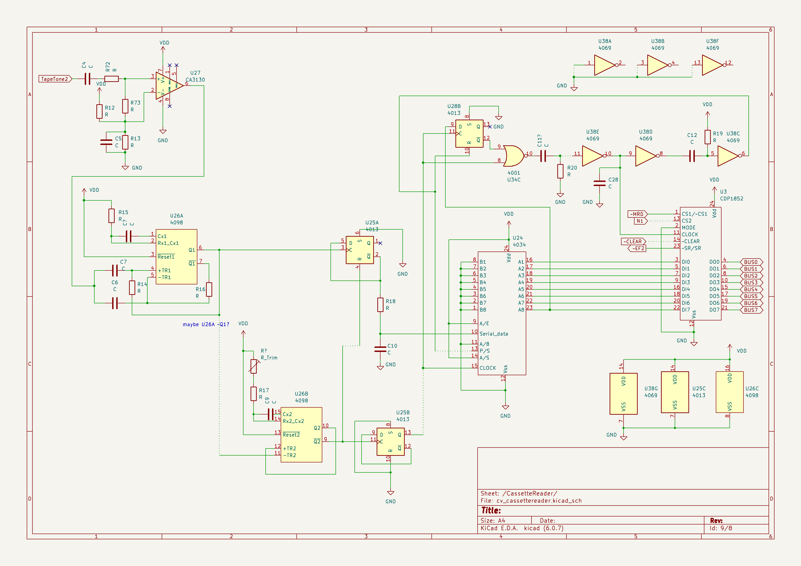
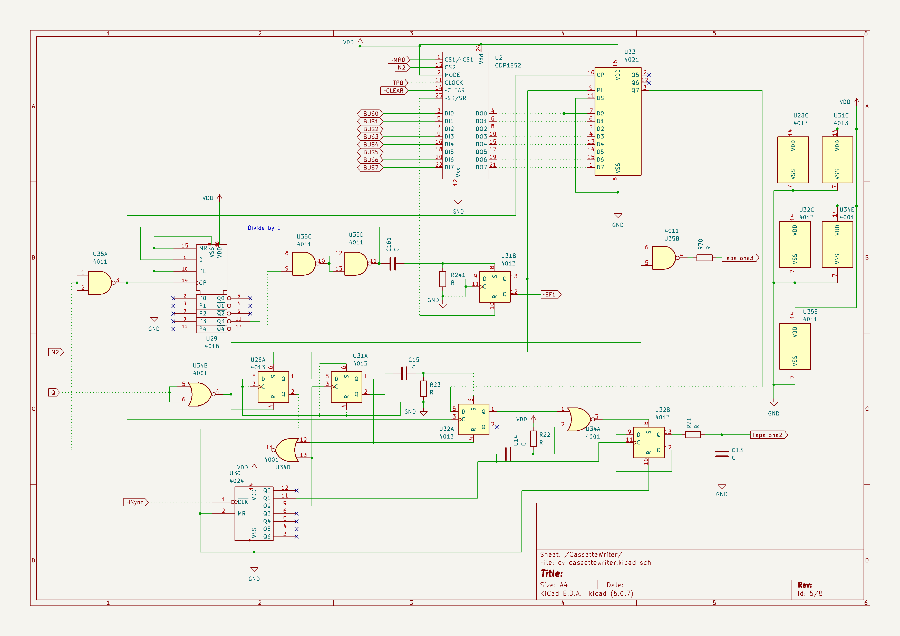
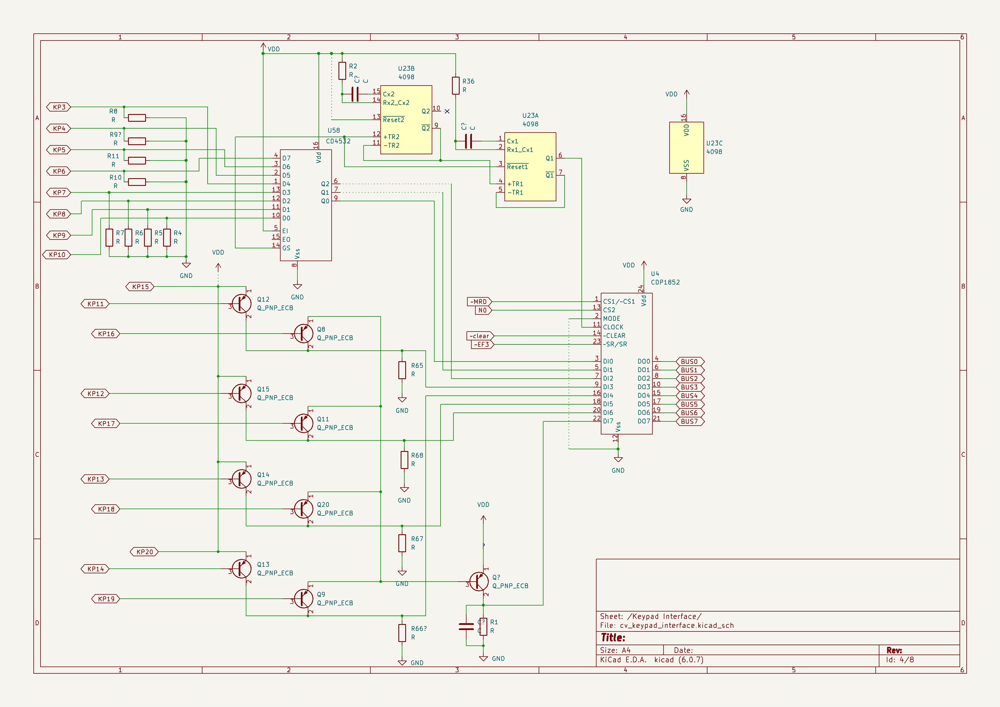

# Schematics for (part of) CyberVision 2001

Here is my partial reconstruction of the schematic for CyberVision 2001. 
PDF and KiCad(Eeschema) files are in "files" directory. 
Dotted lines show my guesses, with different degrees of certainty, 
about wires behind parts (mostly ICs). 
Both the schematics and my analyses may contain inaccuracies. 

  - [Tape Load](#tape-load)
  - [Tape Save](#tape-save)
  - [Keypad](#keypad)

## Tape Load

* The data is being decoded even when Q=0 (but normally there would be no input then).

* The polarity of the input is basically insignificant.

* After the start bit, the data for INP 2 is ready as soon as 8 bits are read.
It seems that no stop bits are required:
if the first bit after the data bits is 1, it is treated as a start bit.

### Detailed description

Although I am not sure who is going to need this, here is my analysis. 
Perhaps I should draw a timing diagram...

* The audio signal amplified by U27(opamp) is sent to U26A,
and pulses are generated at U26A Q1 for both rising and falling edges.
The decoding is based on these pulses,
so the polarity of the input is basically insignificant.

* A clock for U24(shift register) and U28B(flipflop) is generated
by U26B and U25B from the input:
a pulse at U26A Q1 generates a (negative) pulse at U26B ~Q2,
of length somewhat smaller than 1/4000 s,
and other incoming pulses are ignored for this duration.
Each rising edge of U26B ~Q2 inverts U25B,
and this gives a clock of frequency about 2000 Hz at U25B Q.
A pulse at U26A Q1 also inverts U25A unless U25A R is high(see below). 

* The initial value of U25B Q seems undetermined,
but this should be ok for well-shaped waves.
The phase might be wrong by 90 degrees, if one wave of 4000Hz is lost at the beginning, for example.
After a "1" bit, the phase becomes right, but this first "1" might be read as "0".

* U25A should have 0 initially (i.e. when the pulse at U26A Q1 drives U26B ~Q2 low, see below). 
If there is another pulse at U26A Q1 while U26B ~Q2 is low, U25A is inverted. 
When U26B ~Q2 goes high, 
  - U25B Q is inverted as stated above, 
and if this is the rising edge of U25B Q, the output U25A ~Q is sent to U24(shift register).
This should give 0 if the wave is 4000Hz and 1 if 2000Hz.
These bits are fed into (U24 + U28B) regardless of Q
and the data being transferred.
  - Value 1 of U26B ~Q2 also resets U25A. 

* U24 and U28B form a shift register with 9 bits.
When the "carry bit" U28B Q is 1 and the clock falls,
a clock to U3(CDP1852) is generated
and the value of U24 is transferred to U3 (and ~EF2 falls).
Immediately after that, a pulse to "parallel/serial" of U24 and U28B R is sent
and the shift register is cleared.

* It seems that no stop bits are required.

## Tape Save

* The baudrate seems to be about 1967 (3.5795...MHz/(3.5 * 65 * 8)).

* The wave starts when Q=1 and N2 becomes high (by OUT 4),
and seems to start with 0: 0101(4000Hz) for "0" and 01(2000Hz) for "1"... although I am not completely sure. 
It is stopped (immediately) when Q=0.

* After "OUT 4", a start bit "1" and the 8 data bits are output,
and ~EF1 falls for the next byte just after the output of the last data bit starts. 
It seems that a 1802 program should wait for a little more than 1/2000s 
after ~EF1 falls: 
this gives one stop bit(0). 
Bits "0" are output until the next "OUT 4" (or Q=0).

Audio:
* If Q=0, the LSB of "OUT 4" is sent to the speaker.

### Detailed description

* The clock for this block comes from the HSYNC signal,
which seems to be 3.5795...MHz/(3.5*65)=15.734...kHz.
The baudrate is 1/8 of this, about 1967.

* This clock is activated when N2 becomes high (by OUT 4) while Q=1,
and deactivated (immediately) by Q=0.
(The right way to stop it for a 1802 program would be to wait for EF1,
wait for 1/2000 second for the last "0" bit, and then do REQ).

* The data is sent from U2(CDP1852) to U33(4021, shift register)
and then to the wave generator.
The bit count is done by U29(4018, divide-by-N counter, N=9 here).
A 1967Hz clock is given to U29 while data bits are available.

* The first byte by OUT 4 may not be correctly output,
because U29 and other flipflops may have inappropriate values.

* The counter U29 should have "10000" initially. 
Then, when a byte is written to U2,
a pulse is sent to U31B R, and U31B Q = EF1 falls,
the data is transferred to U33, and the clock to U29
(which is stopped at this moment) is resumed.
Then one start bit(1) and the 8 data bits are sent to wave generating circuit(U32B). 
Just after the last bit is sent, 
~EF1 falls for the next byte. 
At the beginning of the next 2000Hz cycle, the clock to U29 is stopped and 
and a stop bit 0 is sent to wave generator. 
If "OUT 4" is executed in this cycle, the next cycle will be the start bit.  
Until the new data is ready, "0" bits are output.

* The wave is generated at U32B.
It seems that one bit of wave normally starts with 0: 0101 for "0" bit, and 01 for "1" bit.
Immediately after the clock is activated, this seems to be reversed,
but after at least one "0" bit, the polarity becomes "normal".

Audio:
* If Q=0, the LSB of "OUT 4" is sent to the speaker.

## Keypad

